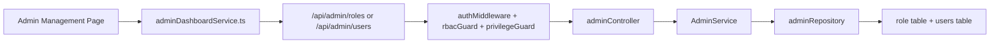

# Admin Role And User Management Guide

## Purpose

This file explains the current role-management and user-management feature centered on the Admin Management page so the team can:

- understand how role creation and user creation actually work
- explain how roles and users interact in the backend
- know which files and functions own each step
- answer contribution questions during defense

This guide focuses on the current canonical admin flow in `Admin Management`, not on older assumptions about `role_scope` being the only driver.

## Scope

Main files involved:

- `frontend/src/admin/pages/global/AdminManagementPage.tsx`
- `frontend/src/admin/components/AddRole.tsx`
- `frontend/src/admin/services/adminDashboardService.ts`
- `frontend/src/admin/routes/adminRoutes.tsx`
- `backend/src/routes/adminRoutes.js`
- `backend/src/controllers/adminController.js`
- `backend/src/services/AdminService.js`
- `backend/src/repositories/adminRepository.js`
- `backend/src/utils/privilegeRegistry.js`
- `backend/src/middlewares/authMiddleware.js`
- `backend/src/middlewares/rbacGuard.js`
- `backend/src/middlewares/privilegeGuard.js`

## High-Level Design

The current admin system has two connected ideas:

1. Roles define privileges and capabilities.
2. Users are assigned to one role record through `users.role_id`.

This means:

- the frontend chooses a role by `roleId`
- the backend looks up the selected role record
- the backend derives the account scope from `role.baseScope`
- the backend writes both:
  - `users.role_id`
  - `users.role_scope`

Important consequence:

- the admin page is no longer just assigning a raw string like `CONSUMER` or `VENDOR`
- it is assigning a specific role record first, then deriving the effective application scope from that record

## One-Slide Flow



## Frontend Structure

## Admin page entry

Main page:

- `frontend/src/admin/pages/global/AdminManagementPage.tsx`

It has two tabs:

- `Role Management`
- `User Management`

The page is available through:

- `frontend/src/admin/routes/adminRoutes.tsx`
  - `/admin/manage`

Frontend route protection:

- only `GLOBAL_ADMIN` can open the main Admin Management page

## Role Management tab

Main UI behaviors:

- loads roles using `getAdminRoles()`
- opens `CreateRoleModal` for create and edit
- shows `userCount` for each role
- clicking the user count switches to the user tab and filters users by `roleId`
- deletes a role only if:
  - it is not a built-in system role
  - it has no assigned users

Main frontend functions:

- `RoleManagementSection`
- `handleRoleUserCountClick`
- `loadRoles`

## User Management tab

Main UI behaviors:

- loads users using `getAdminUsers()`
- also loads roles so the create/edit user form can show valid role options
- filters users by selected `roleId`
- creates users with:
  - name
  - email
  - password
  - roleId
- updates users with:
  - firstName
  - lastName
  - email
  - roleId
- toggles user status between `Active` and `Suspended`
- deletes users

Main frontend functions:

- `UserManagementSection`
- `loadUsers`
- `handleToggleBan`
- `UserFormModal`
- `handleSubmit`

## Frontend service layer

Main service file:

- `frontend/src/admin/services/adminDashboardService.ts`

Key API functions:

- `getAdminRoles()`
- `createAdminRole()`
- `updateAdminRole()`
- `deleteAdminRole()`
- `getAdminUsers()`
- `createAdminUser()`
- `updateAdminUser()`
- `updateAdminUserStatus()`
- `deleteAdminUser()`
- `getAdminDatabaseTables()`

Important note:

- the Admin Management page uses `roleId` for user creation and update
- this is the current canonical contract for this feature

## Backend Route Layer

Main route file:

- `backend/src/routes/adminRoutes.js`

Role-management routes:

- `GET /api/admin/roles`
- `POST /api/admin/roles`
- `PATCH /api/admin/roles/:id`
- `DELETE /api/admin/roles/:id`

User-management routes:

- `GET /api/admin/users`
- `POST /api/admin/users`
- `PATCH /api/admin/users/:id/role`
- `PATCH /api/admin/users/:id/status`
- `GET /api/admin/users/:id`
- `PATCH /api/admin/users/:id`
- `DELETE /api/admin/users/:id`
- `GET /api/admin/user-management/overview`

Important access-control facts:

- role routes are `GLOBAL_ADMIN` only
- main user-management page is also frontend-global-admin only
- backend user routes support more nuanced business-assistance behavior, but the Admin Management page itself is the global-admin control center

## Middleware And Authorization

The real enforcement is backend-side:

- `authMiddleware`
  - loads user and joined role record
- `restrictToRoles`
  - checks allowed role scopes
- `requirePrivileges`
  - checks table-level privileges such as `users` or `role`

Important security meaning:

- frontend page access is not the real permission system
- the backend checks role scope and privilege table actions before allowing create, update, or delete

## Role Management Flow

## 1. Load role policy catalog for the modal

When the role modal opens, the frontend calls:

- `getAdminDatabaseTables()`

This hits:

- `GET /api/admin/tables`

Backend path:

- `adminRoutes.js` -> `adminController.getDatabaseTables`
- `AdminService.getDatabaseTables`
- `rolePolicyCatalog()` from `backend/src/utils/privilegeRegistry.js`

Important meaning:

- the modal does not ask the database for raw table names
- it asks for the application’s managed privilege catalog
- only application-managed tables and allowed actions are exposed

## 2. Create role

Frontend path:

- `CreateRoleModal.handleSave`
- `createAdminRole()`

Backend path:

- `POST /api/admin/roles`
- `adminController.createRole`
- `AdminService.createRole`
- `adminRepository.createRole`

Important backend logic in `AdminService.createRole`:

- normalizes the role name
- normalizes `tablePrivileges`
- normalizes `systemCapabilities`
- checks delegation permissions with `assertCanDelegateRole`
- writes the role
- writes audit log if actor exists

Important repository behavior in `adminRepository.createRole`:

- inserts into `"role"`
- sets `base_scope` to `GLOBAL_ADMIN`
- stores:
  - `name`
  - `table_privileges`
  - `system_capabilities`
  - `grant_option`
  - `is_system = FALSE`

Critical design fact:

- new custom roles created from this feature are currently created with `base_scope = GLOBAL_ADMIN`
- that means custom roles are currently admin-family custom roles, not vendor or consumer custom roles

This is one of the most important things the team should know.

## 3. Update role

Frontend path:

- `CreateRoleModal.handleSave`
- `updateAdminRole()`

Backend path:

- `PATCH /api/admin/roles/:id`
- `adminController.updateRoleRecord`
- `AdminService.updateRoleRecord`
- `adminRepository.updateRoleRecord`

Important rules:

- built-in roles cannot be renamed
- built-in roles cannot exceed their base policy
- built-in role system capabilities cannot exceed their base capabilities
- `GLOBAL_ADMIN` must keep minimum role/user management privileges
- delegation checks still apply

## 4. Delete role

Frontend path:

- `deleteAdminRole()`

Backend path:

- `DELETE /api/admin/roles/:id`
- `adminController.deleteRoleRecord`
- `AdminService.deleteRoleRecord`
- `adminRepository.deleteRoleRecord`

Deletion rules:

- system roles cannot be deleted
- roles with assigned users cannot be deleted
- only non-system roles with zero assigned users can be removed

## User Management Flow

## 1. Load users

Frontend path:

- `getAdminUsers()`

Backend path:

- `GET /api/admin/users`
- `adminController.getUsers`
- `AdminService.getUsers`
- `adminRepository.findAllUsers`
- `adminRepository.countUsersByRole`

Data returned to UI:

- `id`
- `name`
- `email`
- `role`
- `roleId`
- `roleScope`
- `status`

Important meaning:

- the UI uses both the human-readable role name and the stored `roleId`
- filtering in the admin page is done by `roleId`

## 2. Create user

Frontend path:

- `UserFormModal.handleSubmit`
- `createAdminUser({ name, email, password, roleId })`

Backend path:

- `POST /api/admin/users`
- `adminController.createUser`
- `AdminService.createUser`
- `adminRepository.createUser`

Detailed backend flow:

1. validate `name`, `email`, and `roleId`
2. validate password length
3. hash password with bcrypt
4. split `name` into `first_name` and `last_name`
5. load selected role using `getRoleRecordById`
6. derive `accountScope = assignedRole.baseScope`
7. run `assertCanAssignRole`
8. insert user with:
   - `role_id = assignedRole.id`
   - `role_scope = accountScope`
9. write audit log

Critical design fact:

- the backend does not trust the frontend to set final `role_scope`
- the selected role record decides the final account scope

## 3. Update user

Frontend path:

- `updateAdminUser(id, { firstName, lastName, email, roleId })`

Backend path:

- `PATCH /api/admin/users/:id`
- `adminController.updateUser`
- `AdminService.updateUser`
- `adminRepository.updateUser`

Detailed backend flow:

1. validate provided fields
2. if `roleId` is present:
   - load current user
   - load selected role
   - derive `accountScope = assignedRole.baseScope`
   - run `assertCanAssignRole`
   - prepare `roleAssignment = { roleId, roleScope }`
3. normalize strings
4. call repository update
5. audit the update

Important repository rule:

- if a vendor owns places, the code blocks changing that user away from `VENDOR`

That guard exists in:

- `adminRepository.updateUser`

## 4. Update user role through dedicated endpoint

There is also a dedicated endpoint:

- `PATCH /api/admin/users/:id/role`

Backend path:

- `adminController.updateRole`
- `AdminService.updateRole`

Important current-state note:

- this endpoint exists
- but the Admin Management page currently updates role through the general `PATCH /api/admin/users/:id` flow, not this dedicated route

## 5. Update user status

Frontend path:

- `updateAdminUserStatus(id, status)`

Backend path:

- `PATCH /api/admin/users/:id/status`
- `adminController.updateStatus`
- `AdminService.updateStatus`
- `adminRepository.updateStatus`

Important behavior:

- `Suspended` sets `users.is_banned = true`
- `Active` sets `users.is_banned = false`
- if the user is a vendor and gets banned:
  - owned places are set to `status = 'closed'`
  - `is_open = FALSE`
  - `is_admin_managed = TRUE`
- all refresh tokens for the banned user are revoked

This is a strong cross-feature interaction between user management and stall visibility.

## 6. Delete user

Frontend path:

- `deleteAdminUser(id)`

Backend path:

- `DELETE /api/admin/users/:id`
- `adminController.deleteUser`
- `AdminService.deleteUser`
- `adminRepository.deleteUserRecord`

Important deletion guard:

- vendor users cannot be deleted if they still own places

## How Roles And Users Interact

This is the most important conceptual relationship.

### Role drives user scope

When assigning a role to a user:

- the chosen role record supplies `base_scope`
- that `base_scope` becomes the user’s `role_scope`
- the user also stores the role record id in `users.role_id`

So the relationship is:

```text
role record chosen by admin
-> backend resolves baseScope
-> backend writes users.role_id
-> backend writes users.role_scope
-> authMiddleware loads role privileges later
```

### Auth middleware depends on this link

When the user later authenticates:

- `authMiddleware` joins `users` with `"role"`
- loads:
  - `role_name`
  - `base_scope`
  - `table_privileges`
  - `system_capabilities`
  - `grant_option`
  - `is_system`

This means role assignment in admin management directly affects later authorization.

### User count depends on role assignment

Role Management shows `userCount` per role.

That count comes from:

- `adminRepository.findAllRoles`

It aggregates users grouped by `role_id`.

This is why clicking a role’s user count can filter the user tab by that role.

## File And Function Ownership Map

## Frontend

- `frontend/src/admin/pages/global/AdminManagementPage.tsx`
  - `AdminManagementPage`
  - `RoleManagementSection`
  - `UserManagementSection`
  - `UserFormModal`
- `frontend/src/admin/components/AddRole.tsx`
  - `CreateRoleModal`
- `frontend/src/admin/services/adminDashboardService.ts`
  - `getAdminRoles`
  - `createAdminRole`
  - `updateAdminRole`
  - `deleteAdminRole`
  - `getAdminUsers`
  - `createAdminUser`
  - `updateAdminUser`
  - `updateAdminUserStatus`
  - `deleteAdminUser`
  - `getAdminDatabaseTables`

## Backend route/controller/service/repository

- `backend/src/routes/adminRoutes.js`
  - declares role and user admin endpoints
- `backend/src/controllers/adminController.js`
  - `createRole`
  - `getRoles`
  - `updateRoleRecord`
  - `deleteRoleRecord`
  - `getUsers`
  - `createUser`
  - `updateRole`
  - `updateStatus`
  - `getUserById`
  - `updateUser`
  - `deleteUser`
- `backend/src/services/AdminService.js`
  - `createRole`
  - `getRoles`
  - `updateRoleRecord`
  - `deleteRoleRecord`
  - `createUser`
  - `updateRole`
  - `updateStatus`
  - `updateUser`
  - `deleteUser`
  - helper logic:
    - `assertCanAssignRole`
- `backend/src/repositories/adminRepository.js`
  - `findAllRoles`
  - `createRole`
  - `updateRoleRecord`
  - `deleteRoleRecord`
  - `getRoleRecordById`
  - `getRoleRecordByName`
  - `findAllUsers`
  - `createUser`
  - `getUserById`
  - `updateUser`
  - `updateStatus`
  - `deleteUserRecord`
  - `countUsersByRoleId`
  - `logAuditAction`

## Critical Design Decisions The Team Should Know

1. User creation in Admin Management is role-record driven, not raw-scope driven.
2. New custom roles created here are currently inserted with `base_scope = GLOBAL_ADMIN`.
3. The backend derives `users.role_scope` from the selected role’s `baseScope`.
4. Built-in roles are protected from rename and delete.
5. Role deletion is blocked if users are still assigned.
6. Vendor role removal is blocked if the vendor still owns places.
7. Suspending a vendor also closes their stalls and revokes their sessions.
8. `authMiddleware` later depends on the user-to-role join, so role management directly affects runtime authorization.

## What To Say In Presentation

Use this concise explanation:

- the admin management feature is split into role management and user management
- roles define allowed table privileges and system capabilities
- users are linked to roles by `role_id`
- when creating or updating a user, the backend looks up the selected role and derives the user’s effective application scope from that role
- this prevents the frontend from inventing unauthorized scopes
- built-in roles and active vendor ownership relationships are protected by backend rules

## Member Focus

### Layhok: Global admin + developer interface

Main files:

- `frontend/src/admin/pages/global/AdminManagementPage.tsx`
- `frontend/src/admin/components/AddRole.tsx`
- `backend/src/routes/adminRoutes.js`
- `backend/src/services/AdminService.js`
- `backend/src/repositories/adminRepository.js`
- `backend/src/utils/privilegeRegistry.js`

Must explain:

- how custom roles are created
- how table privileges and system capabilities are stored
- why custom roles are currently admin-family roles
- why role assignment is backend-derived and audited

### Pav: Vendor + Business Assistance

Main focus:

- understand the impact of user status and role changes on vendor-owned places
- understand business-assistance boundaries versus global-admin-only controls
- understand why vendor role changes are blocked when places are still owned

Must explain:

- banning a vendor closes their stalls
- vendor ownership protects against unsafe user-role changes
- user management affects business workflows, not just login state

### Smey: Consumer

Main focus:

- understand how consumer accounts still pass through the same user-role system
- understand that user management determines who can enter consumer, vendor, or admin flows

Must explain:

- the role record chosen in admin management affects what the user can access later
- authorization is enforced through the backend join of `users` and `"role"`

## Final Takeaway

The current admin management system is not just CRUD screens.

It is a role-linked authorization pipeline:

- roles store privileges
- users reference roles
- backend derives scope from role records
- runtime middleware reloads those privileges on every authenticated request

That is the key relationship the team should be ready to explain.
