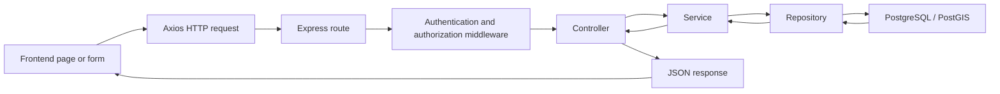
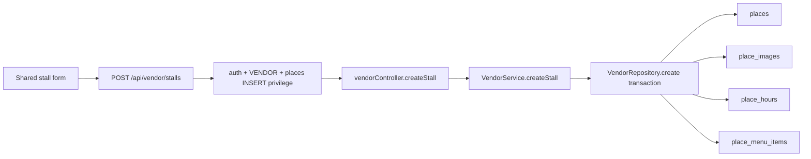
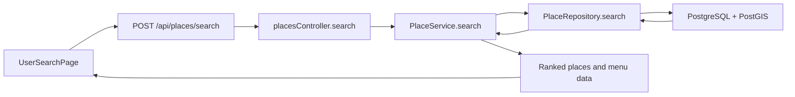

# PathEats Backend Presentation - Team Preparation Guide

Presentation date: **17 July 2026**  
Target duration: **7 minutes**  
Team split:

- **Layhok:** global admin, developer tools, backend security, API documentation, and verification
- **Pav:** vendor and Business Assistance flows
- **Smey:** consumer flows

This is the main preparation file to send to the whole team. Everyone should understand the shared request flow first, then study their assigned section and code locations.

## 1. What the teacher should understand after our presentation

PathEats is not only a collection of frontend pages. It has an organized Express backend that:

- exposes REST endpoints for different user domains
- authenticates users with JWT access and refresh tokens
- enforces roles, privileges, ownership, and system capabilities on the backend
- separates HTTP handling, business rules, and database operations
- uses PostgreSQL and PostGIS as the source of truth
- validates input and returns consistent error responses
- documents endpoints through Swagger
- verifies important behavior with automated tests

Our main message is:

> PathEats keeps route handling small, puts business rules in services, keeps database access in repositories, and protects sensitive operations with backend middleware.

## 2. General request flow everyone must know



### Meaning of each layer

| Layer | Main responsibility | Example |
| --- | --- | --- |
| Route | Selects endpoint and middleware | `POST /api/vendor/stalls` |
| Middleware | Verifies token, role, privilege, or capability | `authMiddleware`, `restrictToRoles` |
| Controller | Reads HTTP input and sends HTTP response | `vendorController.createStall` |
| Service | Applies validation and business rules | `VendorService.createStall` |
| Repository | Executes parameterized SQL and transactions | `VendorRepository.create` |
| Database | Stores the trusted persistent state | PostgreSQL, PostGIS, Supabase database |

### Recommended wording

> When a user performs an action, the frontend sends an HTTP request to an Express route. Middleware first verifies identity and permission. The controller translates the HTTP request into a service call. The service applies business rules, and the repository performs parameterized SQL or a database transaction. The result then returns as a consistent JSON response.

Do not say that the frontend protects the database. The frontend can hide buttons, but the **backend is the real security boundary**.

## 3. Seven-minute slide and speaker plan

The first five minutes explain the system. The remaining two minutes are for demonstration and conclusion.

| Slide | Topic | Main speaker | Target time |
| ---: | --- | --- | ---: |
| 1 | PathEats Backend Development | pav | 10 sec |
| 2 | Presentation overview | pav | 10 sec |
| 3 | Problem, users, and objectives | pav | 20 sec |
| 4 | Backend architecture | pav | 25 sec |
| 5 | Technology stack | pav | 25 sec |
| 6 | REST routes by domain | Layhok | 25 sec |
| 7 | JWT authentication | Layhok | 30 sec |
| 8 | Roles, privileges, and Business Assistance boundaries | Layhok | 25 sec |
| 9 | Route-controller-service-repository separation | Layhok | 25 sec |
| 10 | Vendor business logic, ownership, and transactions | Smey | 25 sec |
| 11 | Global security controls | Smey | 25 sec |
| 12 | Error handling and logging | Smey | 25 sec |
| 13 | Swagger and automated verification | Smey | 30 sec |
| 14 | Live demonstration | Layhok | 8 min 45 sec |
| 15 | Conclusion | Layhok | 15 sec |

If the final slide ownership changes, keep the role-specific code ownership below. Each member may still be questioned individually.

## 4. Code samples suitable for slides

Use short screenshots, not full files. Explain the purpose of the highlighted lines.

### Domain routes

File: `backend/src/routes/api.js`

```js
router.use("/auth", authRoutes);
router.use("/user", userRoutes);
router.use("/vendor", vendorRoutes);
router.use("/admin", adminRoutes);
router.use("/dev", devRoutes);
router.use("/places", placesRoutes);
```

Say:

> The root API router separates public, consumer, vendor, admin, developer, and place operations. This makes the application easier to maintain and lets each domain apply its own authorization rules.

### Role and capability protection

File: `backend/src/routes/devRoutes.js`

```js
router.use(authMiddleware);
router.use(restrictToRoles("GLOBAL_ADMIN", "DEVELOPER_ADMIN"));

router.use("/backups", requireSystemCapability("BACKUP"));
router.use("/recovery", requireSystemCapability("RECOVERY"));
router.use("/query", requireSystemCapability("QUERY"));
```

Say:

> Authentication checks who the user is. Role authorization checks which portal they may enter. Capability authorization adds another restriction for high-risk operations such as recovery or database queries.

### Thin controller

File: `backend/src/controllers/placesController.js`

```js
export const getRoute = catchAsync(async (req, res) => {
  const data = await placeService.getRoute(req.body);
  res.json({ success: true, data });
});
```

Say:

> The controller only handles HTTP input and output. Coordinate validation and routing behavior are implemented in the service, where they can be reused and tested.

### Global security middleware

File: `backend/src/server.js`

```js
app.use(helmet());
app.use(compression());
app.use(cors({ origin: allowedOrigins, credentials: true }));
app.use(express.json({ limit: "2mb" }));
app.use("/api", globalLimiter);
```

Say:

> These controls are applied before the domain routes. Helmet adds secure headers, CORS limits browser origins, the body limit reduces oversized payload risk, and rate limiting reduces abuse.

## 5. Layhok - Global Admin and Developer preparation

### Your presentation responsibility

Be ready to explain:

- the complete backend architecture
- JWT verification and backend authorization
- global-admin versus developer permissions
- system capabilities for backup, recovery, query, and maintenance
- global error handling and auditability
- Swagger and automated verification
- backup and recovery at a high level

### Code locations to open

Study these files in this order:

1. `backend/src/server.js`
   - security middleware
   - `/api` router registration
   - not-found and error handlers
2. `backend/src/routes/api.js`
   - domain route registration
3. `backend/src/middlewares/authMiddleware.js`
   - verifies bearer JWT
   - reloads the user and role from the database
   - rejects missing, expired, deleted-user, or banned-user sessions
4. `backend/src/middlewares/rbacGuard.js`
   - `restrictToRoles(...)`
5. `backend/src/middlewares/privilegeGuard.js`
   - `requirePrivileges(...)`
   - `requireSystemCapability(...)`
6. `backend/src/routes/adminRoutes.js`
   - global-admin and Business Assistance route boundaries
   - table action checks such as `SELECT`, `INSERT`, `UPDATE`, and `DELETE`
7. `backend/src/routes/devRoutes.js`
   - developer role and capability gates
   - route-only structure with no database logic
8. `backend/src/controllers/developerController.js`
9. `backend/src/services/DeveloperService.js`
   - query validation
   - health, metrics, logs, and maintenance logic
10. `backend/src/controllers/developerBackupController.js`
11. `backend/src/services/DeveloperBackupService.js`
   - backup profiles, scheduled artifacts, downloads, and recovery orchestration
12. `backend/src/services/backupService.js`
13. `backend/src/services/backupRecoveryService.js`
14. `backend/src/middlewares/errorMiddleware.js`
   - safe error response
   - trace ID and server-side structured log
15. `backend/src/swagger/swagger.js`
16. `backend/src/swagger/routeCatalog.js`
17. `backend/src/routes/api.integration.test.js`
18. `backend/src/routes/architecture.test.js`

### Code implementation to understand

#### Authentication

The access token is verified, but the backend does not trust token data alone. `authMiddleware` queries `users` and joins the `role` table on every protected request. This lets the backend detect a banned user, deleted account, or changed role.

Recommended wording:

> We verify the JWT signature and then reload the current user and role from PostgreSQL. Therefore, changing a role or banning an account affects later protected requests instead of trusting stale frontend state.

#### Three authorization levels

1. `authMiddleware` - is this a valid signed-in user?
2. `restrictToRoles(...)` - is this user allowed in this backend area?
3. `requirePrivileges(...)` or `requireSystemCapability(...)` - may this role perform this exact operation?

Recommended wording:

> We use defense in depth. A valid token does not automatically give access to every endpoint. The route still checks role scope and the specific table action or system capability.

#### Backup and recovery

Know these differences:

- PostgreSQL custom dump: database or table backup and restore
- CSV: row-oriented export and recovery for a selected table
- database metadata: stored in backup-related tables
- backup artifact: stored as a file and streamed for download
- Supabase Storage images: separate objects; a PostgreSQL dump does not automatically contain the image files

Recommended wording:

> The recovery service validates the selected recovery type, confirmation text, filename extension, dump signature, and target table before executing the correct recovery path. PostgreSQL dumps and CSV files are never sent to the same restore command.

#### Error handling

The public response contains:

```json
{
  "success": false,
  "code": "AUTH_REQUIRED",
  "message": "Please sign in to continue.",
  "traceId": "..."
}
```

Recommended wording:

> The frontend receives a safe message and trace ID. Detailed stack information is kept in server logs and is not exposed in production.

### Likely questions for Layhok

**Why is frontend role checking not enough?**  
Users can modify browser state or call the API directly. Therefore, every sensitive API operation must enforce authorization in backend middleware and service logic.

**What is the difference between a role and a capability?**  
A role gives the general application scope. A capability grants a sensitive system action such as backup, recovery, query execution, or maintenance.

**Does a database backup include Supabase Storage images?**  
No. It backs up PostgreSQL data and image metadata, but the storage objects require a separate storage backup strategy.

**How do you prevent unsafe developer SQL?**  
`DeveloperService` only allows approved read/maintenance prefixes and blocks destructive or data-changing keywords. Access is also restricted by role and the `QUERY` capability.

**Where can the teacher inspect the API?**  
Swagger UI is available at `/api-docs` outside production, with the raw OpenAPI specification at `/api-docs.json`.

## 6. Pav - Vendor and Business Assistance preparation

### Your presentation responsibility

Be ready to explain:

- how a vendor creates and manages a stall
- why the backend derives ownership from the authenticated vendor
- how one transaction saves the place, image metadata, hours, and menu links
- how `menu_items` differs from `place_menu_items`
- how Business Assistance shares some admin routes without receiving every global-admin permission
- how service and repository layers keep route logic small

### Code locations to open

Study these files in this order:

1. `frontend/src/shared/pages/StallCreatePage.tsx`
   - shared stall form used by multiple role interfaces
2. `frontend/src/vendor/routes/vendorRoutes.tsx`
3. `backend/src/routes/vendorRoutes.js`
   - vendor authentication, role restriction, and table privileges
4. `backend/src/controllers/vendorController.js`
   - `createStall`
   - `updateStall`
   - menu item controller functions
5. `backend/src/services/VendorService.js`
   - `createStall(ownerId, data)`
   - `updateStall(ownerId, stallId, data)`
   - `linkExistingMenuItem(...)`
6. `backend/src/repositories/VendorRepository.js`
   - `findOwnedById(id, ownerId)`
   - `create(data)`
   - `linkMenuItemsToPlace(...)`
   - `update(id, ownerId, data)`
7. `backend/src/utils/placeHours.js`
8. `backend/src/utils/storageImageMetadata.js`
9. `backend/src/routes/adminRoutes.js`
   - `businessOrGlobal`
   - vendor, stall, menu, review, and onboarding operations
10. `backend/src/services/AdminService.js`
11. `backend/src/repositories/adminRepository.js`

### Vendor create-stall flow



### Code implementation to understand

#### Ownership comes from authentication

`VendorService.createStall(ownerId, data)` receives `ownerId` from `req.user.sub`. It then builds the repository input with:

```js
{
  owner_id: ownerId,
  ...data
}
```

The trusted `owner_id` is written after spreading the client data, so client input cannot replace it.

Recommended wording:

> We do not trust an owner ID sent by the browser. The controller uses the authenticated JWT user ID, and repository update queries include both the resource ID and owner ID. This prevents one vendor from modifying another vendor's stall.

#### One transaction protects consistency

`VendorRepository.create` uses `db.transaction(...)` to:

1. insert the `places` row
2. save primary image metadata
3. replace operating hours
4. link authorized menu items

Recommended wording:

> Stall creation changes several related tables, so we execute the required database steps in one transaction. If a required step fails, PostgreSQL rolls back the database work instead of leaving an incomplete stall.

#### Menu catalog versus stall link

- `menu_items`: vendor-owned reusable catalog item
- `place_menu_items`: junction table linking an item to a stall
- the link also holds stall-specific availability and price
- the composite place/item key prevents duplicate links

Recommended wording:

> We do not duplicate the whole menu item for every stall. The catalog item belongs to the vendor, and the junction table links it to one or more stalls with place-specific price and availability.

#### PostGIS coordinate order

The repository stores location using:

```sql
ST_SetSRID(ST_MakePoint(longitude, latitude), 4326)::geography
```

Recommended wording:

> PostGIS expects longitude first and latitude second in `ST_MakePoint`. We use SRID 4326 and store the value as geography for distance-based behavior.

#### Business Assistance boundary

`adminRoutes.js` allows `GLOBAL_ADMIN` and `BUSINESS_ASSISTANCE` at the router level, but sensitive endpoints add narrower role, privilege, or capability guards. Global-admin-only operations include higher-risk role management and selected audit or system operations.

Recommended wording:

> Business Assistance can support vendor, stall, menu, review, and onboarding workflows according to its configured privileges. It is not automatically given every global-admin operation.

### Likely questions for Pav

**How do you stop IDOR between vendors?**  
Repository queries scope the resource with both `id` and `owner_id`, using the authenticated user ID rather than trusting the client.

**Why use a transaction for stall creation?**  
The operation affects multiple related tables. A transaction prevents partial database state if one required insert fails.

**Why is `place_menu_items` necessary?**  
It models the many-to-many relationship between places and menu items and stores link-specific price and availability.

**Can Business Assistance manage roles?**  
Not by default. Role-management endpoints use global-admin-only guards and specific role-table privileges.

**Can a vendor reopen a stall closed by an admin?**  
No. `VendorService.updateStall` detects an admin-managed closed stall and rejects a vendor attempt to reopen it.

## 7. Smey - Consumer preparation

### Your presentation responsibility

Be ready to explain:

- the problem PathEats solves for consumers
- public place search and place detail flow
- route-aware search using coordinates and PostGIS
- consumer authentication and protected personal data
- reviews, bookmarks, saved routes, and search history
- why review updates and deletes are scoped to the authenticated consumer

### Code locations to open

Study these files in this order:

1. `frontend/src/user/pages/UserSearchPage.tsx`
2. `frontend/src/user/pages/UserVendorDetailPage.tsx`
3. `frontend/src/user/hooks/useBookmarks.tsx`
4. `frontend/src/user/hooks/useSavedRoutes.tsx`
5. `frontend/src/user/hooks/useSearchHistory.tsx`
6. `backend/src/routes/placesRoutes.js`
   - public search and place detail
   - protected review writes
7. `backend/src/controllers/placesController.js`
8. `backend/src/services/PlaceService.js`
   - `search(...)`
   - `getById(...)`
   - `createReview(...)`
   - `updateReview(...)`
   - `deleteReview(...)`
   - `getRoute(...)`
9. `backend/src/repositories/PlaceRepository.js`
   - search SQL and PostGIS behavior
   - menu and review queries
10. `backend/src/routes/userRoutes.js`
11. `backend/src/controllers/userController.js`
12. `backend/src/services/UserService.js`
13. `backend/src/repositories/UserRepository.js`
14. `backend/src/services/AuthService.js`

### Consumer search flow



### Code implementation to understand

#### Public reading, protected writing

`placesRoutes.js` allows public search and place-detail requests, but review create, update, and delete routes use:

```js
authMiddleware,
restrictToRoles("CONSUMER"),
requirePrivileges({ table: "reviews", action: "INSERT" })
```

Recommended wording:

> Anyone may discover public places, but writing a review requires a valid consumer account and the correct review privilege. The backend applies these checks even if someone calls the API without using our frontend.

#### Search service

`PlaceService.search`:

- validates that a route has enough points
- passes filters to `PlaceRepository.search`
- loads menu items for the returned places
- converts database rows into consumer-facing data
- calculates a ranking score using affordability, distance, and rating

Recommended wording:

> The repository performs the spatial and filtering query. The service then combines the database results with menu data and produces the response format and ranking used by the consumer interface.

#### External routing validation

`PlaceService.getRoute` validates latitude and longitude ranges before calling OSRM. If OSRM is unavailable, the current implementation returns a fallback path and marks it with `wasFallback: true`.

Recommended wording:

> We validate coordinates before external communication. The routing response also tells the frontend whether it came from OSRM or the fallback path, so the system can continue operating during a routing-service failure.

#### Review ownership

The service passes both `reviewId` and `userId` to repository update and delete operations. If the review does not belong to that user, no matching row is returned.

Recommended wording:

> A consumer cannot edit another consumer's review by changing an ID. The database operation is scoped to both the review and authenticated user.

#### Personal consumer data

`userRoutes.js` protects profile, bookmarks, saved routes, and search history with authentication, the `CONSUMER` role, and table privileges. `UserService` validates required fields and checks business rules before calling `UserRepository`.

Recommended wording:

> Personal consumer data uses a separate protected route group. For example, the bookmark service first checks that the place is publicly available before saving the bookmark.

### Likely questions for Smey

**Which consumer endpoints are public?**  
Public place search, scoring, routing, categories, place details, and review reading are available through the places API. Review writing and personal user data require authentication.

**Where is the search logic implemented?**  
The route calls `placesController.search`, which calls `PlaceService.search`, which delegates spatial SQL to `PlaceRepository.search`.

**How do you validate ratings?**  
`PlaceService` requires ratings between 1 and 5 before creating or updating a review.

**How do you prevent users from editing other reviews?**  
Update and delete repository operations include the authenticated user ID in the database condition.

**What happens if OSRM fails?**  
The service logs the external failure and returns a marked fallback path instead of crashing the whole request.

## 8. Live demonstration plan

Keep the demonstration under **1 minute 45 seconds**.

### Smey - approximately 35 seconds

1. Open Swagger.
2. Call `GET /api/health` and show `200`.
3. Show a public place endpoint.
4. Call a protected consumer endpoint without a token and show `401 AUTH_REQUIRED`.

Say:

> This proves that public discovery remains accessible while personal consumer data is protected by the backend.

### Pav - approximately 35 seconds

1. Authorize Swagger with a vendor JWT, or show the vendor stall workflow in the running application.
2. Open the `POST /api/vendor/stalls` documentation.
3. Point out the authenticated vendor and ownership-scoped backend flow.

Say:

> The browser submits stall data, but the backend supplies the trusted owner ID and saves the related database records through a transaction.

### Layhok - approximately 35 seconds

1. Show a protected admin or developer endpoint.
2. Show Swagger's bearer-token support.
3. Finish with the automated test result.

Run before the presentation:

```powershell
npm.cmd --workspace backend run lint
npm.cmd --workspace backend test
npm.cmd --workspace frontend run build
```

Latest verified backend result before this guide: **8 test files and 24 tests passed**. Run the command again on presentation day because the code may change.

## 9. How to explain code confidently

For every screenshot, use this three-part pattern:

1. **What:** identify the layer and function.
2. **Why:** explain the design or security reason.
3. **Proof:** identify the condition, query parameter, middleware, transaction, or test that proves it.

Example:

> This is the vendor route layer. It first applies JWT authentication and the VENDOR role guard. The create-stall endpoint also requires INSERT permission on the places table. These middleware checks execute before the controller, so the protection does not depend on the frontend button.

Avoid saying:

- “This code just connects everything.”
- “The frontend checks the role, so it is secure.”
- “We use JWT to encrypt all data.” JWT signs identity claims; HTTPS protects data in transit.
- “A database backup includes all uploaded images.” Storage objects are separate.
- “All logic is in the controller.” Business logic belongs mainly in services.
- “Business Assistance is the same as Global Admin.” Their allowed operations differ.
- “The tests prove every live database workflow.” Current integration checks verify HTTP routing and error behavior without destructively restoring a live production database.

## 10. Shared rapid Q&A

**Why did you choose layered architecture?**  
It separates HTTP concerns, business rules, and SQL. That makes the code easier to maintain, reuse, test, and secure.

**Authentication versus authorization?**  
Authentication proves identity. Authorization decides which resources and actions that identity may access.

**How do you prevent SQL injection?**  
Application queries use parameter placeholders such as `$1` with values passed separately instead of concatenating untrusted input into SQL.

**Why use transactions?**  
Transactions ensure multi-table operations either complete together or roll back together.

**Why PostgreSQL and PostGIS?**  
PostgreSQL provides relational integrity and transactions. PostGIS adds spatial types and distance-based querying for route-aware food discovery.

**How are errors handled?**  
Operational errors are passed to one global error middleware that selects a safe status, code, message, and trace ID while logging detailed server context.

**How is the API documented?**  
Swagger generates an OpenAPI interface at `/api-docs`, including bearer authentication and registered endpoint information.

**What automated verification exists?**  
Utility tests cover CSV, backup table-of-contents parsing, place hours, and storage metadata. HTTP integration tests verify public health, protected routes, consistent validation errors, and coordinate rejection. Architecture tests reject database access or bypass code in route/controller layers and check Swagger route coverage.

## 11. Final preparation checklist

### Everyone tonight

- read Sections 1-4 and your personal section
- open every primary backend file listed for your role
- trace one complete request from route to repository
- practice your wording without reading paragraphs from the slide
- prepare answers to your five role-specific questions
- know the difference between authentication, role authorization, privilege, ownership, and capability

### Team rehearsal

- complete one timed seven-minute run
- verify presenter handoffs
- use the same terms: route, middleware, controller, service, repository
- keep code screenshots to approximately 4-7 visible lines
- confirm the backend and frontend start successfully
- sign in to the demo accounts before presenting
- keep Swagger and the terminal open in separate tabs
- run backend lint and tests again
- prepare a backup screenshot of the successful test result

### Final handoff sentence

Smey can close with:

> PathEats combines organized REST APIs, database-backed authorization, reusable service logic, ownership-scoped SQL, consistent error handling, Swagger documentation, and automated verification. These decisions make the backend safer to operate and easier to extend.
