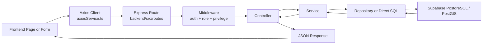
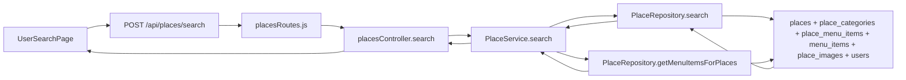
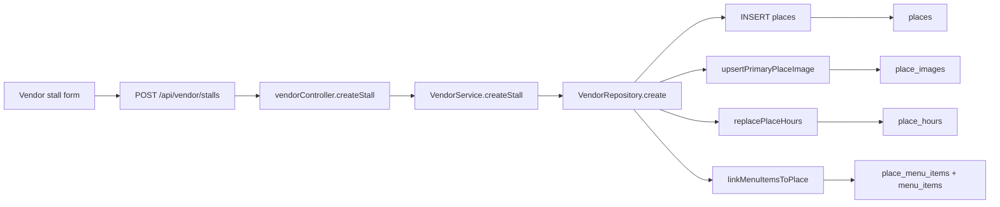
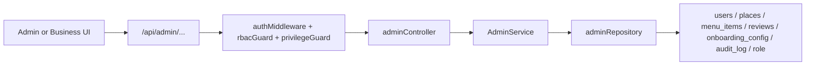
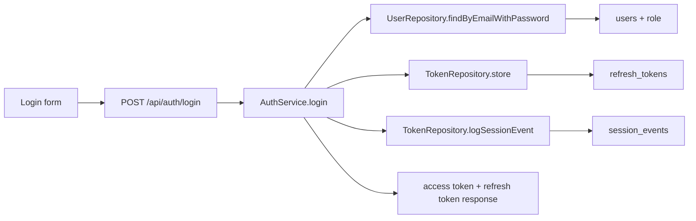

# System Data Flow Guide

## Purpose

This file explains the real request and data flow of the PathEats system so the team can:

- understand how frontend actions reach the database
- explain backend design during presentation
- identify which files and functions each member should study
- convert the flow into defense slides without guessing

Use this file in future sessions as the quick map for tracing code from UI to database.

## Scope

This guide is based on the current implementation in:

- `frontend/src/shared/services/axiosService.ts`
- `frontend/src/user/routes/userRoutes.tsx`
- `frontend/src/vendor/routes/vendorRoutes.tsx`
- `frontend/src/admin/routes/adminRoutes.tsx`
- `backend/src/routes/*.js`
- `backend/src/controllers/*.js`
- `backend/src/services/*.js`
- `backend/src/repositories/*.js`
- `backend/src/config/db.js`

## One-Slide Flow

Use this condensed flow on slides:

## Core Architecture Flow

### 1. Frontend entry

The frontend sends HTTP requests through `frontend/src/shared/services/axiosService.ts`.

Important behavior:

- attaches the correct portal token from local storage
- refreshes expired access tokens through `/api/auth/refresh`
- redirects to the correct login page when the session is invalid

### 2. Backend route layer

API entry starts at:

- `backend/src/server.js`
- `backend/src/routes/api.js`

`api.js` splits requests into domains:

- `/api/auth`
- `/api/user`
- `/api/vendor`
- `/api/admin`
- `/api/dev`
- `/api/places`

### 3. Middleware layer

The main backend gatekeeping happens before business logic:

- `backend/src/middlewares/authMiddleware.js`
  - verifies JWT
  - loads user row from `users`
  - joins the `"role"` table
  - blocks banned users
- `backend/src/middlewares/rbacGuard.js`
  - checks allowed role scope such as `CONSUMER`, `VENDOR`, `GLOBAL_ADMIN`
- `backend/src/middlewares/privilegeGuard.js`
  - checks table-level privileges and system capabilities

This is important for presentation: frontend page visibility is not the real security boundary. Backend middleware is.

### 4. Controller layer

Controllers translate HTTP requests into service calls.

Main files:

- `backend/src/controllers/placesController.js`
- `backend/src/controllers/vendorController.js`
- `backend/src/controllers/adminController.js`
- `backend/src/controllers/userController.js`

Controllers are thin. Most business rules are moved into services and repositories.

### 5. Service layer

Services hold business rules and validation.

Main files:

- `backend/src/services/AuthService.js`
- `backend/src/services/PlaceService.js`
- `backend/src/services/VendorService.js`
- `backend/src/services/AdminService.js`
- `backend/src/services/backupService.js`
- `backend/src/services/backupRecoveryService.js`

### 6. Repository / SQL layer

Repositories hold most SQL and transaction logic.

Main files:

- `backend/src/repositories/PlaceRepository.js`
- `backend/src/repositories/VendorRepository.js`
- `backend/src/repositories/adminRepository.js`
- `backend/src/repositories/UserRepository.js`
- `backend/src/repositories/TokenRepository.js`
- `backend/src/repositories/OtpRepository.js`

### 7. Database layer

The application uses direct PostgreSQL access through `pg` in `backend/src/config/db.js`.

Important design fact:

- the app does not rely on Supabase client SDK for its main request flow
- the backend talks directly to PostgreSQL
- PostGIS is used for location and distance queries

## Real Data Flows By Feature

## Consumer Flow

### Search nearby places

Files and functions to study:

- `frontend/src/user/pages/UserSearchPage.tsx`
- `backend/src/routes/placesRoutes.js`
- `backend/src/controllers/placesController.js` -> `search`
- `backend/src/services/PlaceService.js` -> `search`
- `backend/src/repositories/PlaceRepository.js` -> `search`, `getMenuItemsForPlaces`

Key design points:

- route points are converted into GeoJSON
- the database filters by distance from the route
- only active, open, non-deleted places are returned
- banned vendor-owned places are filtered out by joining `users owner_user`

### View place detail and reviews

Files and functions:

- `backend/src/controllers/placesController.js` -> `getById`, `getReviews`
- `backend/src/services/PlaceService.js` -> `getById`, `getReviews`
- `backend/src/repositories/PlaceRepository.js` -> `findById`, `getMenuItems`, `getReviews`

### Create, update, delete consumer review

Files and functions:

- `backend/src/routes/placesRoutes.js`
- `backend/src/controllers/placesController.js` -> `createReview`, `updateReview`, `deleteReview`
- `backend/src/services/PlaceService.js` -> same methods
- `backend/src/repositories/PlaceRepository.js` -> same methods
- `backend/src/db/seed.sql` -> `refresh_place_rating()` trigger function

Key design points:

- only authenticated consumers can write reviews
- duplicate active reviews are blocked
- review writes recalculate `places.rating_avg` and `places.rating_count`
- soft delete is used through `reviews.deleted_at`

## Vendor Flow

### Create stall

Files and functions to study:

- `frontend/src/vendor/pages/StallCreatePage.tsx`
- `backend/src/controllers/vendorController.js` -> `createStall`
- `backend/src/services/VendorService.js` -> `createStall`
- `backend/src/repositories/VendorRepository.js` -> `create`, `linkMenuItemsToPlace`
- `backend/src/utils/placeHours.js` -> `normalizeOperatingSchedule`, `replacePlaceHours`
- `backend/src/utils/storageImageMetadata.js`

Key design points:

- ownership is fixed from the authenticated vendor, not trusted from client input
- one transaction inserts the stall, hours, image metadata, and menu links
- location is stored with `ST_SetSRID(ST_MakePoint(longitude, latitude), 4326)::geography`

### Manage menu catalog and place-specific menu links

Files and functions:

- `backend/src/controllers/vendorController.js`
  - `createMenuItemGlobal`
  - `updateMenuItemGlobal`
  - `createStallMenuItem`
  - `linkExistingStallMenuItem`
  - `updateStallMenuItem`
- `backend/src/services/VendorService.js`
- `backend/src/repositories/VendorRepository.js`
  - `createMenuItemGlobal`
  - `createMenuItem`
  - `linkExistingMenuItem`
  - `updateMenuItem`

Key design points:

- `menu_items` is the vendor-owned catalog
- `place_menu_items` links catalog items to specific stalls
- place-specific price is stored in `place_menu_items.price`
- the same menu item is not duplicated for every stall

## Admin / Business Assistance Flow

### Manage users, stalls, reviews, onboarding

Files and functions to study:

- `frontend/src/admin/routes/adminRoutes.tsx`
- `backend/src/routes/adminRoutes.js`
- `backend/src/controllers/adminController.js`
- `backend/src/services/AdminService.js`
- `backend/src/repositories/adminRepository.js`

Key design points:

- global admin and business assistance share some routes, but not all permissions
- business assistance is limited mainly to vendor-related operations
- global admin can manage roles, audit logs, and higher-risk operations
- admin actions are written to `audit_log`

## Developer / Backup Flow

### Backup download and recovery

Files and functions:

- `backend/src/routes/devRoutes.js`
- `backend/src/services/backupService.js`
  - `generateBackupForProfile`
  - `createPostgresDumpFile`
  - `createPostgresCsvFile`
- `backend/src/services/backupRecoveryService.js`
  - `restoreFullDump`
  - `restoreTableDump`
  - `restoreCsvFile`
- `backend/src/services/backupScheduler.js`

Key design points:

- developer routes are capability-gated, not only role-gated
- backup metadata is stored in database tables
- backup artifacts are also written to disk
- CSV row-level recovery and PostgreSQL dump recovery use different code paths

## Auth Flow

Files and functions:

- `backend/src/routes/authRoutes.js`
- `backend/src/services/AuthService.js`
- `backend/src/repositories/UserRepository.js`
- `backend/src/repositories/TokenRepository.js`
- `backend/src/repositories/OtpRepository.js`

Key design points:

- authentication is custom JWT-based
- refresh tokens are stored hashed in `refresh_tokens`
- session lifecycle is tracked in `session_events`
- password reset uses runtime-created `otps`

## What To Say In Slides

Suggested speech scope:

1. Start with the generic pipeline: frontend -> route -> middleware -> controller -> service -> repository -> database.
2. Use one concrete flow to prove understanding.
3. For this project, the best examples are:
   - consumer search
   - vendor stall creation
   - admin role and privilege enforcement
4. Emphasize that business rules are enforced in backend code and SQL relationships, not only in frontend UI.

## Member Study Split

## Layhok: Global Admin + Developer Interface

Primary files:

- `frontend/src/admin/routes/adminRoutes.tsx`
- `backend/src/routes/adminRoutes.js`
- `backend/src/routes/devRoutes.js`
- `backend/src/controllers/adminController.js`
- `backend/src/services/AdminService.js`
- `backend/src/services/backupService.js`
- `backend/src/services/backupRecoveryService.js`
- `backend/src/repositories/adminRepository.js`

Must understand:

- role and privilege enforcement
- audit logging
- backup and recovery flow
- user and stall management flow

## Pav: Vendor + Business Assistance

Primary files:

- `frontend/src/vendor/routes/vendorRoutes.tsx`
- `backend/src/routes/vendorRoutes.js`
- `backend/src/controllers/vendorController.js`
- `backend/src/services/VendorService.js`
- `backend/src/repositories/VendorRepository.js`
- `backend/src/utils/placeHours.js`

Must understand:

- vendor ownership rules
- stall creation and update transaction flow
- menu catalog versus place-specific menu links
- business assistance boundaries in admin routes

## Smey: Consumer

Primary files:

- `frontend/src/user/routes/userRoutes.tsx`
- `backend/src/routes/placesRoutes.js`
- `backend/src/routes/userRoutes.js`
- `backend/src/controllers/placesController.js`
- `backend/src/controllers/userController.js`
- `backend/src/services/PlaceService.js`
- `backend/src/repositories/PlaceRepository.js`

Must understand:

- public place search and detail flow
- bookmarks, routes, and search history flow
- review creation and soft deletion
- why only active, open, non-banned vendor content is shown

## Final Takeaway

The system is organized as:

- frontend pages trigger HTTP requests
- backend middleware enforces identity, role, and privilege
- services apply business rules
- repositories run SQL and transactions
- PostgreSQL with PostGIS is the source of truth

That is the main flow to explain when the teacher asks how the code actually works.
